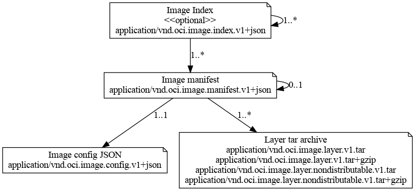

# OCI Image Media Types

The following media types identify the formats described here and their referenced resources:

- `application/vnd.oci.descriptor.v1+json`: [Content Descriptor](descriptor.md)
- `application/vnd.oci.image.manifest.list.v1+json`: [Manifest list](manifest-list.md#manifest-list)
- `application/vnd.oci.image.manifest.v1+json`: [Image manifest](manifest.md#image-manifest)
- `application/vnd.oci.image.config.v1+json`: [Image config](config.md)
- `application/vnd.oci.image.layer.v1.tar`: ["Layer", as a tar archive](layer.md)
- `application/vnd.oci.image.layer.nondistributable.v1.tar`: ["Layer", as a tar archive with distribution restrictions](layer.md#non-distributable-layers)

## Suffixes

[RFC 6839][rfc6839] defines several structured syntax suffixes for use with media types.
This section adds additional structured syntax suffixes for use with media types in OCI Image contexts.

### The +gzip Structured Syntax Suffix

[GZIP][rfc1952] is a widely used compression format.
The media type [`application/gzip`][rfc6713] has been registered for such files.
The suffix `+gzip` MAY be used with any media type whose representation follows that established for `application/gzip`.
The media type structured syntax suffix registration form follows:

Name: GZIP file format

`+suffix`: `+gzip`

References: [[GZIP][rfc1952]]

Encoding considerations: GZIP is a binary encoding.

Fragment identifier considerations:

The syntax and semantics of fragment identifiers specified for `+gzip` SHOULD be as specified for `application/gzip`.
(At publication of this document, there is no fragment identification syntax defined for `application/gzip`.)
The syntax and semantics for fragment identifiers for a specific `xxx/yyy+gzip` SHOULD be processed as follows:

* For cases defined in `+gzip`, where the fragment identifier resolves per the `+gzip` rules, then process as specified in `+gzip`.
* For cases defined in `+gzip`, where the fragment identifier does not resolve per the `+gzip` rules, then process as specified in `xxx/yyy+gzip`.
* For cases not defined in `+gzip`, then process as specified in `xxx/yyy+gzip`.

Interoperability considerations: n/a

Security considerations:

See the "Security Considerations" sections of [RFC 1952][rfc1952] and [RFC 6713][rfc6713].
Each individual media type registered with a `+gzip` suffix can have additional security considerations.

Implementations MUST support the `+gzip` suffix for all [OCI Image Media Types](#oci-image-media-types).
For example, they MUST support `application/vnd.oci.image.layer.v1.tar+gzip` and `application/vnd.oci.image.layer.nondistributable.v1.tar+gzip` for [manifest `layers`](manifest.md#image-manifest-property-descriptions) and `application/vnd.oci.image.manifest.v1+json+gzip` for [manifest list `manifests`](manifest-list.md#manifest-list-property-descriptions).

## Media Type Conflicts

[Blob](image-layout.md) retrieval methods MAY return media type metadata.
For example, a HTTP response might return a manifest with the Content-Type header set to `application/vnd.oci.image.manifest.v1+json`.
Implementations MAY also have expectations for the blob's media type and digest (e.g. from a [descriptor](descriptor.md) referencing the blob).

* Implementations that do not have an expected media type for the blob SHOULD respect the returned media type.
* Implementations that have an expected media type which matches the returned media type SHOULD respect the matched media type.
* Implementations that have an expected media type which does not match the returned media type SHOULD:
    * Respect the expected media type if the blob matches the expected digest.
      Implementations MAY warn about the media type mismatch.
    * Return an error if the blob does not match the expected digest (as [recommended for descriptors](descriptor.md#properties)).
    * Return an error if they do not have an expected digest.

## Compatibility Matrix

The OCI Image Specification strives to be backwards and forwards compatible when possible.
Breaking compatibility with existing systems creates a burden on users whether they be build systems, distribution systems, container engines, etc.
This section shows where the OCI Image Specification is compatible with formats external to the OCI Image and different versions of this specification.

### application/vnd.oci.image.manifest.list.v1+json

**Similar/related schema**

- [application/vnd.docker.distribution.manifest.list.v2+json](https://github.com/docker/distribution/blob/master/docs/spec/manifest-v2-2.md#manifest-list) - mediaType is different

### application/vnd.oci.image.manifest.v1+json

**Similar/related schema**

- [application/vnd.docker.distribution.manifest.v2+json](https://github.com/docker/distribution/blob/master/docs/spec/manifest-v2-2.md#image-manifest-field-descriptions)

### application/vnd.oci.image.layer.v1.tar

**Interchangeable and fully compatible mime-types**

- With `+gzip`

    - [application/vnd.docker.image.rootfs.diff.tar.gzip](https://github.com/docker/docker/blob/master/image/spec/v1.md#creating-an-image-filesystem-changeset)

### application/vnd.oci.image.config.v1+json

**Similar/related schema**

- [application/vnd.docker.container.image.v1+json](https://github.com/docker/docker/blob/master/image/spec/v1.md#image-json-description)

## Relations

The following figure shows how the above media types reference each other:

[Descriptors](descriptor.md) are used for all references.
The manifest list being a "fat manifest" references one or more image manifests per target platform. An image manifest references exactly one target configuration and possibly many layers.

[rfc1952]: https://tools.ietf.org/html/rfc1952
[rfc6713]: https://tools.ietf.org/html/rfc6713
[rfc6839]: https://tools.ietf.org/html/rfc6839
